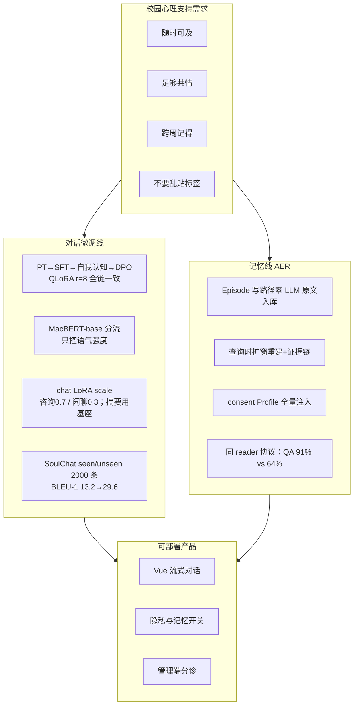

# SoulHarbor 的故事：一个「会记得、不乱记」的校园心理支持助手

> **终稿叙事**（与当前 `product_app/` 源码、`train/`、`evaluate/` 对齐）。  
> 本文只回答三个问题：**我们为什么做、怎么做的、做得怎样**。实现细节见 `01`～`06`，这里的每个数字都能在 `evaluate/*/runs/` 里找到对应跑次。

---

## 0. 一句话

大学生缺一个**随时可及、足够共情、还跨得了周**的情绪支持入口——但不能把气话写成人格，也不能把旧状态当成现在。  
SoulHarbor 用两条各司其职的线解决它：**路由感知的对话微调**负责「怎么说」，**原文库 + 查询时自适应经历重建（AER）**负责「怎么记」。

如果只允许记住一句话，那么是这句：**SoulHarbor 在心理长程对话里证明了一件事——记忆的形态决定了记忆的质量。同一个答题模型，只把背后的记忆库从"抽取式事实列表"换成"原文经历库 + 查询时重建"，长程 QA 准确率从约 64% 提到 91%。**

---

## 1. 问题：校园场景里缺的不是"会聊天"，是"会记得地聊天"

高校心理咨询资源有限，预约难、等候长、污名化也让很多人更愿意先找一个"能说话的地方"。通用大模型聊天很方便，但把它直接丢进校园心理支持，会暴露三类落差。

第一类是**不会好好说**：空泛、说教、复读、冷冰冰。基座模型并没有为"倾听一个人"这种对话做过专门对齐，它的默认语气更接近回答百科问题。第二类是**记不住**：学生上周讲的保研、室友、失眠，这周再来就像面对陌生人——普通多轮助手只有会话内上下文，跨会话一片空白。第三类是**乱记得**：一旦系统尝试"记住用户"，最常见的做法是把对话抽取成几条事实条目，比如"你是回避型人格""你一直和室友处不好"。

第三条最危险，而且它不是靠调 prompt 能解决的，是**记忆形态**的问题。心理对话里，一次冷战、一句气话、一次面试失利，如果被系统在写入时归纳成稳定标签，它会在之后每一轮对话里反复自我强化，误导判断，甚至伤害信任。心理场景的代价结构是反常识的：**错误归纳的代价远高于漏召回**。漏召回顶多是"没帮上忙"，错误归纳是"把用户往错误的自我认知上推了一把"。

所以产品的目标不是"更强的百科助手"，而是：在校园场景里做一个**可开关长期记忆**的心理支持助手——说得像咨询，记得住经历，不擅自给人贴标签，也不替代专业医疗诊断。

---

## 2. 设计立场：两条线为什么必须一起做

把问题拆开，会发现"怎么说"和"怎么记"是两个独立得多的技术问题，合在一起才成产品。

**只有对话微调、没有记忆**，模型再会共情，跨周回来仍是陌生人，个性化无从谈起。**只有记忆、没有对齐**，检索出的经历块会被一个没学过倾听的模型念成病历或者说明书。这两条线在工程上也是解耦的：对话线依赖 Qwen3-14B + LoRA + MacBERT 分流；记忆线依赖 BGE-M3、字级 BM25 与一套纯代码编排的检索管线，两者只在"生成前把记忆块拼进 system"这一处交汇。

我们最终的立场，浓缩成一句话：

> **Episode 写入尽量不"理解"用户；Profile 只经 consent 落少量偏好；读路径再把原文编年重建成可用的经历证据。**

这个立场不是一开始就有的，是**被实验证据逼出来的**——这段演进在第 5 节展开。

---

## 3. 对话线：先学会怎么陪伴

### 3.1 训练路线

基座选择 Qwen3-14B：中文能力强、原生支持工具调用，且在 4-bit 量化 + LoRA 下可以单卡部署，比 32B/72B 现实得多。训练用 LLaMA-Factory 做 QLoRA（4-bit NF4），全链路统一 **r=8 / α=16**，四个阶段链式续训、各自保留独立 LoRA 目录（`train/configs/*.yaml` 与线上 `adapter_config.json` 一致）：

1. **继续预训练（PT）**：EmoLLM 的心理 Q-A 片段 2.4 万条，纯文本 CLM，让基座在心理中文分布上"更熟"；
2. **主指令 SFT**：约 90% SoulChatCorpus + 10% EmoLLM data_pro，2 万条 ShareGPT 多轮，学"怎么按咨询的节奏回话"；
3. **自我认知 SFT**：274 条人设问答，把"你是谁"稳定成 SoulHarbor，而不是随便认领别的产品；
4. **DPO**：3000 对偏好数据，chosen 来自语料中的较好回复，rejected 由 MiniMax-M2.7 按"空泛、欠共情、敷衍、说教"指令合成，专门压心理场景最刺眼的失败模式。线上 chat LoRA 即此产物（`dpo_synth_*`）。

数据细节与真实 JSON 样例见 `04`。

### 3.2 路由与 LoRA scale：一个"旋钮"控制语气强度

心理对话里"咨询"和"闲聊"是两种不同的说话方式：倾诉需要更稳定的共情与边界，寒暄需要更轻、不"假装在做治疗"。我们没有让 14B 每轮自我判断，而是用**独立的 MacBERT-base 二分类器**（3000 条咨询/闲聊对照数据，1:1 均衡、按字长对齐，验证准确率约 99.7%）判断 `is_consult`，只做一件事：把同一份 **chat LoRA（`dpo_synth_*`）** 的推理 **scale** 从 0.3（闲聊）切到 0.7（咨询）。会话滚动摘要走**裸基座**（`disable_adapter`），避免 DPO 共情腔渗进压缩。

这里有个容易被误读的设计：**分类器只控制语气强度，不控制记忆开关**。是否检索记忆只由用户的 `memory_enabled` 决定，与 `is_consult` 完全解耦。这么做的理由很实际——闲聊里也可能聊到上一周的事，把记忆绑死在"咨询路由"上反而丢信息；而把分类器的职权缩小到"一个旋钮"，即使它偶尔判错，代价也只是语气强弱，而不是整个对话行为被带偏。

生成侧工程细节：单卡上一份 4-bit 基座 + 一份 chat LoRA，GPU 用 `RLock` 串行；同 adapter 上按场景调 scale，无需 merge、也无需第二份任务 LoRA。

### 3.3 对话效果：自动指标能证明什么

在 SoulChatCorpus 的 seen/unseen 各 1000 条上做自动指标评测（jieba 分词后计算 BLEU/ROUGE，每个模型单独汇总），结果是：

| 模型 | BLEU-1 | ROUGE-1 | ROUGE-L |
|------|--------|---------|---------|
| base（裸 Qwen3-14B） | 13.23 | 20.52 | 15.04 |
| sft（自我认知 SFT） | **29.56** | 30.65 | **24.64** |
| dpo（线上 chat LoRA） | 27.91 | **31.49** | 24.44 |

（全表 BLEU-1/2/3/4、ROUGE-1/2/L 见 `02` §10.6，跑次在 `evaluate/dialogue/runs/soulchat_corpus_eval_20260426_092741/`。）

这张表要诚实解读。SFT 相对 base 的跃升（BLEU-1 +16、ROUGE-L +9.6）证明领域对齐有效；但 **DPO 的 BLEU 反而比 SFT 略低**，ROUGE-1/2 略高。这不是失败，而是 DPO 本来就不是在刷 n-gram 重合——它优化的是"更共情、少敷衍"的偏好，表达更自然更多样时，字面重合度下降是正常现象。这也是我们一直强调**自动指标只能做相对比较**的原因：心理对话没有唯一标准答案，BLEU/ROUGE 无法单独证明"更共情"，真正的产品体验还要靠注入位置、语气与安全设计共同保证。

---

## 4. 记忆线：AER——怎么记，才不乱记

### 4.1 一句话立场与命名

长期记忆子系统叫 **AER（Adaptive Experience Reconstruction，自适应经历重建）**，实现全部在 `product_app/app/memory/`，`MEMORY_BACKEND=aer`。它的命题是：

```text
不要在写入时把人生压缩成几条"确信事实"；
要在提问时，从原文里重建"那段经历的证据"。
```

### 4.2 写路径：Episode 零 LLM；Profile 旁路可提议

每条 user / assistant 消息在对话落库后进入后台 `EpisodeIngestor`：按确定性规则分块（≤500 字整段，否则按句界切成 150–350 字），用 BGE-M3 向量化，原样写进 SQLite（`memory_episode_chunks` + `memory_episode_embeddings`），嵌入失败进重试队列。**Episode 入库没有 LLM**：不抽取事实、不合并覆盖、不生成摘要、不把瞬时情绪升级成特质。

唯一允许落库的"理解"是一条**旁路**——Profile（支持偏好），而且必须走 consent：

| 操作 | 触发 | 行为 |
|------|------|------|
| 显式记住 | 用户说「记住 / 别忘了…」 | 立刻 `create_explicit` |
| LLM 提议 | 助理回合后攒批触发（默认 ≥5 条消息或 ≥300s；`MEMORY_PROFILE_LLM_*`） | pending 空时中文 LLM（`proposer.py`）最多抽 **1** 条 → **pending**（须 evidence 对上用户原文；确认前不成记忆；闲聊由模型返回空） |
| 助理正则提议 | 回复含「要不要我记住…」 | 弱补充入 pending |
| 确认 | 用户整句「可以 / 对 / 好的…」 | **一次确认清空队列、全部落库**为 `confirmed` |
| 更正 | 「A 改成 B」或「我现在不要 A」 | 软删匹配项；有新内容则再写入 |
| 忘掉 | 「忘掉 / 删掉…」 | 按关键词软删画像（及可匹配原文块） |
| 查看 | 「你都记住了什么」 | 只返回已确认偏好清单（不暴露原文库） |

写库前 `policy.py` 硬拦诊断词、人格标签、瞬时情绪前缀等高风险内容。画像数量很小，读路径会**全量注入** active 偏好（上限 30），不再按查询过滤——避免站立偏好被漏召回。与 MemMachine「抽完即画像」不同：SoulHarbor **确认前不算记忆**。

### 4.3 读路径：智能全部发生在查询时

当用户开启长期记忆，每轮生成前跑 `RetrievalPipeline`：

1. **查询路由**（无关键词正则门控）：有 LLM 时用规划器 prompt 输出 `direct` 或 `split` JSON（最多 3 条子查询）；无 LLM / 失败则整句 `direct`；
2. **混合召回**：BGE-M3 余弦（assistant 角色块 ×0.55 降权）+ 中文友好的**字级 unigram/bigram BM25**，RRF 融合出 top-8 作为锚点（seed）；
3. **AER 扩窗**：对每个锚点沿会话向前后做"连续性游走"——候选消息的得分由与锚点的语义相似度、与已选区的相似度、实体重叠、位置邻接、与查询词的重叠五部分加权（0.40/0.22/0.18/0.10/0.10）组成，连续两次低于阈值（默认 0.28）就停。产出的是**一段完整经历**，而不是孤立句子；
4. **重叠合并与特征重排**：同会话相邻窗口合并；再按融合分、查询词重叠、是否含用户话轮等特征排序（特征重排取代了此前的 LLM 重排，读路径更短）；
5. **跨会话时序证据链**：按实体重叠、语义相似、时间间隔（指数衰减）、查询信息增益把分散在多周的经历串成链，链内按时间排序，打上 `[经历链 E1]` 标签；
6. **覆盖度贪心选择**：在候选池里贪心挑 top-6，目标是"相关 + 新信息覆盖 + 时间桶多样性 − 与已选冗余"，避免同时注入好几段内容重复的旧经历；
7. **渲染注入**：Formatter 按链分组，**只取 user 话轮**，尽量整段注入（普通 ≤800 字、seed ≤1000 字）；只在极端超长时才用 BGE 的句子级语义相似度定位相关局部，嵌入失败则保尾部；另附全部 active 支持偏好。整个块受 1600 token 预算约束，超预算整行裁剪；
8. 块以 system 角色注入，前缀明确说明它只是历史背景，冲突时以当前说法为准、禁止补充检索结果之外的事实。

这个链路里除了（可选的）查询规划与重排，**检索主体全部由代码编排**；写侧 Episode 仍零 LLM，Profile 提议 LLM 不进入 `<memory>` 检索链路。代价是检索逻辑复杂，换来的是：召回即证据、注入即原文，记忆库本身从不替用户下结论。

### 4.4 和现有工作的关系：学什么、不学什么

我们评测对照的基线是 **Mem0**（写时抽取事实句 + 向量库检索，行业主流的 flat 抽取路线）；设计上我们认真读过的还有 **MemMachine**（把整段经历当作记忆单元、检索命中后再扩上下文的联想式 episodic 记忆）和 **MemGPT**（分层记忆 + 中断控制的系统观）。我们实际采取的路线是：

| 维度 | Mem0 类 flat 抽取 | MemMachine 类 | SoulHarbor AER |
|------|------------------|---------------|----------------|
| 写入 | LLM 抽事实句 | 保存 episode（原文+向量） | **Episode 原文块零 LLM**；Profile 可选 LLM→pending→确认 |
| 相似 | 向量搜事实 | 向量+BM25，整段候选 | hybrid + **扩窗重建经历** |
| 注入 | 事实句列表 | 选中 episode 尽量全文 | **经历窗 user 原文**；紧预算下语义局部兜底 |
| 心理场景风险 | 写时固化/丢上下文 | 依赖条数控长 | **结构上消除写时污染** |

一句话：**我们学的是"选中的证据尽量完整"（MemMachine），没学"写时把对话压成事实"（Mem0），也没把英文分词式 BM25 或图数据库搬回来。** 不保留图结构是刻意的——单机 SQLite + 向量 JSON 就能跑，部署简单，而 AER 认为经历之间的关联应该在查询时由连续性游走和证据链动态建立，而不是提前固化在边上。

### 4.5 评测：同 reader、只换记忆库

AER 的价值最终要靠对比实验证明，而对比实验最容易犯的错是"换了方法也换了答题模型"，那样差距说不清来源。我们的协议刻意隔离这个变量：

1. 用 MiniMax 按规范合成 **30 条"像真咨询"的长程弧**（每个学生连续 5–7 周、6–7 个会话），每条 3 道测试题（2 MCQ + 1 judge）+ 应记/应忘事实集（`evaluate/memory/data/all_30.jsonl`）；
2. AER 与 Mem0 **在同一对话流上逐轮 ingest**，然后在延迟测试点用**同一个固定 reader（MiniMax-M3）**只接收"该方法的记忆检索块 + 测试题"作答；
3. MCQ 精确匹配 gold，open 题按参考答案 reference-based 判定；另外把最终记忆库与应记/应忘事实集比对算内容 F1。

结果（`evaluate/memory/runs/`）：

| 方法 | QA 准确率 | Staleness 率 | 内容 F1 |
|------|-----------|--------------|---------|
| **AER** | **≈91%** | **≈7%** | **≈0.89** |
| Mem0（同协议） | ≈64% | ≈43% | ≈0.48 |

逐类看，差距的分布非常有信息量：context_recall（"那件事里还提到什么"）0.93 vs 0.47、cross_session_integration（拼多个会话作答）0.93 vs 0.60、current_state（最新状态，抗 stale）1.00 vs 0.60、preference_recall 0.93 vs 0.73、detail_recall 0.93 vs 0.87（**唯一接近的一类**，因为 Mem0 对字面事实也能记住）、temporal_sequence 0.73 vs 0.60（共同短板）。

这套结果的读法，跟 Mem0、LongMemEval 这些论文讲故事的方式一致：**先定义能力维度，再给出隔离变量的对照，最后诚实标注短板**。AER 的优势恰好落在"保留共现上下文、跨会话整合、抗 stale"这些原文库 + 查询时重建的结构性收益上；而字面细节召回双方都强，时序类双方都弱——这反过来印证了差距确实来自记忆形态，而不是答题能力。

---

## 5. 真实演进：AER 不是一拍脑袋的设计

讲清楚"我们到底改进了什么"，最有说服力的方式是展示这条记忆线是怎么一步步走到 AER 的。仓库 `archive/` 完整保留了每个阶段的冻结快照：

**第一阶段：写时 LLM 抽取。** 最初尝试过每轮让模型把对话压成事实条目再 CRUD。即便工具调用指标还能看，结构性隐患仍在：**只要写入时"理解"，就一定会偶尔写错，而写错的标签会一直在库里**。抽取即改写，改写的错永远比漏召回更贵——这对心理场景尤其不可接受。

**第二阶段：分层与写时调和。** 仓库 `archive/` 里还能看到分层记忆、写时 Psychological Reconciler 等中间态。它们试图用衰减、合并、调和缓解污染，但根因没变——底层仍在写入时改写用户。

**第三阶段：存原文 + 检索时扩上下文。** 受「经历单元、命中后再扩窗」思路启发，确立了"存原文、优化读路径"的方向，但仍一度保留写时调和器。

**第四阶段：AER 终稿。** 写时 episode 调和删掉，**Episode 写路径变成零 LLM 的原文入库**；Profile 旁路保留 consent（默认助理后 LLM 最多提议 1 条进 pending）。读路径补上三件套：**自适应边界扩窗**、**覆盖度感知选择**、**跨会话经历链**。中间态快照在 `archive/`，可对照；线上故事只讲 AER。

所以"我们真正改进了什么"的答案是清晰的：**不是把检索做得更花哨，而是把"理解"从写入时刻彻底挪到了查询时刻，再用三次迭代把它推到结构上不可能写时污染的状态。** 对抗 stale 也是这样——不做写时生命周期，而是用查询相关选择 + 覆盖度去冗余 + token 预算把"旧状态"挡在上下文之外。

---

## 6. 合成：一条产品故事



**答辩可用金句**：

1. **微调解决"语气与边界"，记忆解决"连续与证据"；两件事在工程上解耦，合起来才成产品。**
2. **记忆的创新不在"记得更多"，而在"拒绝在写入时乱记"——理解全部后置到查询时。**
3. **我们用同 reader 只换记忆库的协议，证明差距来自记忆形态，而不是答题模型。**
4. **演进史是最好的论据：AER 是被"写时抽取必然偶尔写错"的实验证据逼出来的终态，不是拍脑袋。**

---

## 7. 诚实的边界（终稿也要说清）

- **不替代心理咨询与医疗**：系统是辅助倾听与情绪支持；危机情形应转介，不做自动报警的产品承诺。
- **评测集偏小**：记忆长程 QA 只有 30 条受控数据；对话自动指标不能等价于临床有效性。
- **temporal 仍是共同短板**：约 60–73%，可以往证据链里加显式时间锚进一步改善。
- **抗 stale 靠读路径**：没有写时生命周期状态机，"已结束处境"主要靠查询相关选择、覆盖度与预算抑制。
- **单卡串行、SQLite**：语义召回用按用户 FAISS 缓存加速；适合原型与单机部署。数据量再上一个量级时可换 HNSW / 多卡推理。
- **单元测试在本地 `product_app/tests/`（不入库）**。
- **已知局限**：跨会话串链没有单独的「多样性下限」；覆盖度选择里的周桶多样性已覆盖大部分场景，integration 类约 0.93，暂不追加启发式。

---

## 8. 文档地图

| 文档 | 读什么 |
|------|--------|
| **本文 `00`** | 背景、动机、演进史、方案故事、效果总览 |
| `01_项目大纲与架构.md` | 目录、架构图、模块职责、模型选型卡片 |
| `02_项目详尽技术文档.md` | 配置、链路、引擎、记忆代码级细节、训练超参、评测 |
| `03_保研面试问答手册.md` | 答辩问答 + 技术原理 + 伦理 + 文献 |
| `04_数据构建与样例.md` | 每类训练数据从哪来、长什么样、真实 JSON 样例 |
| `05_记忆系统_AER…最终方案.md` | AER 逐步算法与评测数据构建 |
| `06_记忆系统_对比实验设计.md` | 记忆 QA 协议与主表 |
| `evaluate/` | 对话与记忆的真实跑次 |
| `README.md` | 启动与入口 |

---

## 9. 收束

SoulHarbor 的完成态，不是"又一个套了 RAG 的聊天框"。它把两件难事收进同一个产品：把大模型调教成愿意好好听的校园助手；把长期记忆建成"经历证据库"而不是"人格标签机"，并在同协议、同 reader 的评测里对 Mem0 交出可核对的数字。演进史（`archive/`）、训练流水线（`train/`）、评测跑次（`evaluate/*/runs/`）和产品源码（`product_app/`）互相印证——这就是这个故事能立住的全部理由。
