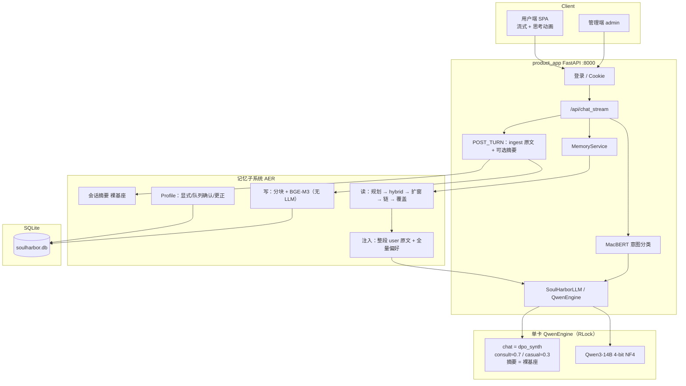

# SoulHarbor 项目大纲、架构与功能介绍

> 文档版本：与 `product_app/` 当前代码对齐（终稿）  
> **故事与动机**：先读 [`00_SoulHarbor故事与终稿叙事.md`](./00_SoulHarbor故事与终稿叙事.md)  
> 路径基准：仓库根目录。FastAPI `app.version` 为 `0.2.0`。

---

## 一、项目定位

**SoulHarbor** 是由大连理工大学团队开发的**校园心理健康智能对话系统**。它把以下四块能力组合成一套可单机部署的端到端产品：

1. **意图分流**：MacBERT-base 二分类（咨询 / 闲聊），只负责控制语气强度；
2. **路由感知生成**：同一 Qwen3-14B 4-bit 基座上挂一份 DPO **chat LoRA**，咨询 / 闲聊用不同 scale（约 0.7 / 0.3）；会话摘要用裸基座；
3. **个性化长期记忆**：**原文库 + 查询时自适应经历重建（AER，backend=`aer`）**——写路径按确定性分块把消息**原样**入库（BGE-M3，不抽取、不归纳）；读路径 LLM 规划器（可选）→ hybrid → AER 扩窗 → 链 → 覆盖度选择 → 全量 active Profile → `<memory>`；Profile 走 consent（显式 / 提议队列确认 / 更正 / 忘掉）；会话摘要由裸基座非阻塞生成；
4. **Web 产品形态**：用户端 Vue 3 SPA 流式对话 + 隐私/记忆开关；管理端匿名化会话浏览与分诊队列。

从设计的角度看，这四块可以被归成两条主线。**对话线**回答"怎么好好说"：分类器 + 一个 LoRA scale 旋钮。**记忆线**回答"怎么好好记"：写入零理解，理解只发生在查询时刻。两条线只在"生成前把记忆块拼进 system"交汇。

**一句话**：校园场景下的「分流 + 共情生成 + 可开关长期记忆（原文库 + 查询时重建）」心理支持助手，不替代专业医疗诊断。

**核心技术栈**：FastAPI · SQLite · Vue 3 + Vite · Qwen3-14B（4-bit QLoRA）· MacBERT-base · BGE-M3 + 字级词法混合检索 + AER。

---

## 二、目录结构（运行时）

```
SoulHarbor/
├── product_app/                    # ★ 生产 Web 应用
│   ├── app/                        # FastAPI + 记忆子系统（memory/ = AER）
│   ├── frontend/                   # Vue 3 + Vite 用户端 SPA 源码
│   ├── static/spa/                 # SPA 构建产物
│   ├── templates/                  # 管理端 Jinja2
│   ├── start.sh                    # 一键启动
│   └── README.md
├── prompts/
│   └── system_soulharbor_zh.txt    # ★ 主对话 system
├── models/                         # 本地权重（不入库）
│   ├── Qwen3-14B/
│   └── encoders/chinese-macbert-base · bge-m3
│   └── encoders/bge-reranker-v2-m3（历史 rerank，现行未用）
├── saves/qwen14b/lora/
│   └── dpo_synth_*/                # 对话 DPO LoRA（默认 chat adapter）
├── outputs/classifiers/intent/     # 意图分类器
├── train/                          # 微调 scripts + configs
├── evaluate/
│   ├── dialogue/                   # 主对话评测
│   └── memory/                     # 长期记忆 QA（data/all_30.jsonl）
├── 项目文档/                       # 00 故事 · 01–06 技术与评测
├── README.md
└── archive/                        # 历史材料（不入库）
```

训练在 `train/`；评测在 `evaluate/`。均**不是**启动服务所必需。单元测试仅在本地 `product_app/tests/`（不入库）。

---

## 三、系统架构总览



**主路径**：意图分流决定 chat LoRA scale → `MemoryService.build_chat_context` 组装摘要/近期原文/`<memory>` → 流式生成 → 后台 `run_post_turn` 写入原文库并可能触发摘要。

长期记忆细节与评测见 `05` / `06`；微调与数据见 `04` / `02`；叙事见 `00`。

### 单轮对话时序（真实模式）

1. 用户发消息 → 写入 `messages`  
2. `_prepare_chat_turn` 先调 `MacBERT` 预测 `is_consult`；  
3. 再调 `MemoryService.build_chat_context`：AER 读路径跑 `RetrievalPipeline`（router → hybrid → 扩窗 → 链 → 覆盖选择 → profile），渲染 `<memory>`  
4. `generate_chat_stream(is_consult=)`：咨询 scale≈0.7，闲聊 scale≈0.3  
5. 流式返回；后台线程可继续写完 assistant 落库  
6. `append_turn_metrics` 记录路由指标  
7. post-turn：`ingest_message` 分块向量化原样入库；未摘要 token 超阈值时用裸基座生成滚动摘要（≤400 字）

**意图路由主要影响**：对话 LoRA 强度与指标统计。  
**记忆与意图解耦**：用户开启长期记忆时即走 AER 读写；`is_consult` 不再门控记忆。

---

## 四、功能清单

### 用户端

| 功能 | 说明 |
|------|------|
| 注册 / 登录 | Cookie `auth` + 会话 `sid`；登录时 rotate sid 防跨用户串号 |
| 流式对话 | `/api/chat_stream`；首 token 前「正在思考」动画 |
| 新建 / 切换 / 重命名 / 删除会话 | 切换时 Abort 前端流；后端可继续生成并落库 |
| 长期记忆开关 | 开启 / 关闭 / 一键遗忘；**不向用户展示记忆原文** |
| 免责声明 | 页脚：不替代专业医疗；紧急情况联系当地服务 |

### 管理端

| 功能 | 说明 |
|------|------|
| 密码登录 | 默认 `soulharbor_admin`；校验通过生成 `secrets.token_hex(16)` token 写 `_ADMIN_TOKENS` set，cookie 仅保存 token |
| 统计 | 今日会话量、路由分布等（`/admin/api/stats`） |
| 会话工作区 | 匿名化浏览消息与指标（`/admin/api/conversations`、`/admin/api/conversations/{sid}`、`/admin/api/conversation-workspace`） |
| 用户画像工作区 | 用户级统计（`/admin/api/users`、`/admin/api/users/{hash}/profile`、`/admin/api/user-profile-workspace`），记忆内容对用户端不可见 |
| 分诊队列 | triage 状态更新（`/admin/api/triage`、`/admin/api/triage_records`、`/admin/api/triage/update`） |

### 记忆能力（产品语义）

| 能力 | 说明 |
|------|------|
| 长期记忆后端 | `aer`（原文库 + 查询时 AER），开关受 `MEMORY_BACKEND` / `MEMORY_STORE_ENABLED` 控制 |
| 写入 | post-turn 把 user+assistant 确定性分块、BGE-M3 向量化后**原样**入库（`store/ingest.py`）；无 LLM 抽取、不合并、不概括；嵌入失败进重试队列 |
| Profile | consent 旁路：显式「记住…」→ 直接存；助理提议 → pending 队列（最多 8）；用户「可以」→ **确认队列全部**；「A改成B」更正；政策层拦截诊断词/人格标签/瞬时情绪 |
| 遗忘 | 「忘掉/删掉…」按关键词软删画像与原文块；`/api/memory/forget-all` 一键清空；前端不展示记忆原文 |
| 召回 | 规划器（direct/split）→ hybrid（BGE-M3 + 字级 BM25）→ AER 扩窗 → 合并 → 特征重排 → 跨会话链 → 覆盖度 top-6；active 偏好**全量注入**（≤30） |
| 注入 | `<memory>`：尽量整段 user 原文 + 日期/来源 + `[支持偏好]`；单条软上限约 800–1000 字，极端超长才做句子级语义截取；总预算默认 1600，超预算整行裁剪 |
| 会话摘要 | 未摘要消息累计 token 达 `memory_summary_window_max_tokens`（默认 3000）后，由裸基座（temperature 0.3）生成 ≤400 字摘要并重置窗口；`_summary_in_progress` 集合 + `threading.Lock` 防同会话并发 |

---

## 五、模型与权重一览

> 每个组件按 **是什么 → 为何选 → 起什么作用** 说明。训练产出的 LoRA / 分类 checkpoint 也列入（线上会加载）。

### 5.1 总表

| 组件 | 本地路径 | 类型 | 线上是否加载 | 是否另训 |
|------|----------|------|--------------|----------|
| **Qwen3-14B** | `models/Qwen3-14B` | 因果 LLM 基座 | 是（4-bit） | 其上挂 LoRA |
| **chat LoRA**（DPO） | `saves/.../dpo_synth_*` | PEFT adapter | 是，名 `chat` | 本仓库训 |
| **MacBERT-base** | `models/encoders/chinese-macbert-base` | 中文 Encoder | 作分类骨架 | 预训练权重加载后微调分类头 |
| **意图 checkpoint** | `outputs/classifiers/intent/checkpoint-*`（当前 `checkpoint-188`） | 二分类头+微调后权重 | 是（`_pick_checkpoint_dir` 取 trainer_state 最佳步） | 本仓库训 |
| **BGE-M3** | `models/encoders/bge-m3` | 检索向量模型 | 是 | **不另训** |
| **MiniMax-M2.7 / M3** | （外部 API，无本地权重） | 外部生成模型 | 否 | 仅离线造 DPO rejected / 评测 reader |

### 5.2 Qwen3-14B（唯一大模型基座）

| | |
|--|--|
| **是什么** | 阿里通义 **Qwen3** 系列开源稠密因果语言模型，约 **14.8B** 参数；支持 thinking / non-thinking 切换与多轮对话。 |
| **为何选** | ① 中文与指令遵循强，够做校园心理对话；② **14B** 在单卡 4-bit + 一份 LoRA 下可部署，比 32B/72B 更现实；③ LLaMA-Factory / transformers 生态成熟。未选纯 API：要本地可控、可复现。 |
| **起什么作用** | 所有生成都走这一份基座：用户可见回复、可选记忆规划/重排、会话摘要。推理默认 **BNB 4-bit NF4 + double quant**；训练用 QLoRA。线上对话关闭 thinking（`enable_thinking=false`）。 |

### 5.3 chat LoRA（`dpo_synth_*`）— 对话偏好对齐

| | |
|--|--|
| **是什么** | 挂在 Qwen3-14B 上的 **LoRA**，由 PT→SFT→自我认知→**DPO** 流水线得到；PEFT 名 **`chat`**。 |
| **为何选** | 不 merge、不另起第二个 14B：省显存；同 adapter 用不同 scale 区分咨询/闲聊；摘要关 LoRA。DPO 专门压「敷衍 / 欠共情」。 |
| **起什么作用** | 用户可见生成；咨询 **scale=0.7**、闲聊 **0.3**；会话 **摘要** 关闭 LoRA、走裸基座（客观压缩）。可选记忆规划/重排走 chat @ casual scale。 |

### 5.4 chinese-macbert-base + 意图 checkpoint — 咨询/闲聊分流

| | |
|--|--|
| **是什么** | **MacBERT**（Cui et al., Findings of EMNLP 2020，[arXiv:2004.13922](https://arxiv.org/abs/2004.13922)）：用「近义替换」式 MLM 改进的中文 BERT。本项目用 **base** 骨架，在 SoulChat 正 / LCCC 负的对照数据上微调出 `checkpoint-188`（`AutoModelForSequenceClassification`，训练细节见 `04` §8）。 |
| **为何选** | ① 分流只要二分类，不必每轮调 14B；② 毫秒～几十毫秒级、可离线评测；③ 与生成解耦，避免「大模型既当裁判又当运动员」；④ MacBERT 在中文分类上是成熟强基线。**选 base 而非 large 的理由**：分流任务本身足够简单，base 的验证准确率已到 99.7%、测试 99.0%，再加大模型只换更慢的推理；把显存留给 14B 主模型与 BGE-M3。未选 LLM 零样本分类：慢且不稳。 |
| **起什么作用** | 输出 `is_consult∈{0,1}` → 决定 chat LoRA **scale**（咨询 0.7 / 闲聊 0.3）与指标统计；**不**决定是否检索记忆（记忆与意图已解耦）。路径：`models/encoders/chinese-macbert-base` + 分类头微调产物；线上 `IntentClassifier._pick_checkpoint_dir` 优先取 `trainer_state.json` 里 `best_global_step` 对应的 checkpoint（当前为 `outputs/classifiers/intent/checkpoint-188`）。 |

### 5.5 BGE-M3 + 词法检索 — 长期记忆混合召回

| | |
|--|--|
| **是什么** | 记忆写路径用 **BGE-M3**（1024 维 dense）编码每一条原文分块并入库；读路径 **hybrid 召回**：BGE-M3 cosine + 中文友好的字级 unigram/bigram BM25，RRF 融合出核心（pivot top-8）。 |
| **为何选** | ① 用户级语料小但文本是原文，字级 BM25 对中文人名/专名/数字敏感，与 dense 互补；② AER 扩窗 + 覆盖度选择在候选池上直接完成，链路短、默认无逐轮 LLM；③ BGE-M3 中文检索强、开箱即用。 |
| **起什么作用** | 写入同步 embedding（失败进重试队列）；读路径 hybrid → AER 扩窗 → 跨会话链 → 覆盖度选择 → 注入。 |

### 5.6 MiniMax-M2.7 — 仅离线造 DPO 负样本

| | |
|--|--|
| **是什么** | 外部 API 大模型（数据 `meta.rejected_gen_model=MiniMax-M2.7`）。 |
| **为何选** | 需要大量「仍相关但更敷衍/欠共情」的 rejected；用强模型按指令合成，比人工写 3000 条负样本可行。 |
| **起什么作用** | **只参与数据构建**，产品运行时**不调用**。 |

### 5.7 生成接口 × scale（运行时怎么挂）

| 生成接口 | Adapter | Scale | temperature | 用途 |
|----------|---------|-------|-------------|------|
| `generate_chat` / `generate_chat_stream` | chat | consult **0.7** / casual **0.3** | 0.6（引擎默认） | 用户可见回复 |
| `generate_summary` | （关 LoRA） | — | 0.3 | 会话摘要（裸基座） |

更细的引擎实现见 `02` §6；训练超参见 `02` §10.5；面试口述见 `03`。

---

## 六、Prompt 清单（线上）

| # | 用途 | 位置 |
|---|------|------|
| 1 | 主对话 system | `prompts/system_soulharbor_zh.txt` |
| 2 | 记忆注入前缀（"历史背景，冲突以当前说法为准"） | `product_app/app/memory/service.py` → `_MEMORY_SYSTEM_PREFIX` |
| 3 | 会话摘要外壳 | `product_app/app/memory/inject.py` → `build_session_summary_block` |
| 4 | 会话摘要生成 | `product_app/app/memory/extract.py` → `SUMMARY_SYSTEM` |
| 5 | 记忆写路径 | **无 LLM prompt**（确定性分块 + 向量化；consent 画像用正则+政策规则） |
| 6 | 检索规划器 system | `product_app/app/memory/retrieval/router.py` → `_PLANNER_SYSTEM` |

> 线上记忆不再使用写时抽取 agent；中间态见 `archive/`。

---

## 六.5 关键时序图（答辩时可直接引用）

### 6.5.1 单轮对话时序（流式）

```
用户          浏览器          FastAPI            MacBERT        BGE-M3        Qwen3-14B         SQLite
 │ 点发送       │                │                  │              │              │                │
 │──────────────>│                │                  │              │              │                │
 │              │ POST /chat_stream              │              │              │                │
 │              │────────────────>│              │              │              │                │
 │              │                │ 鉴权 + sid 解析 │              │              │                │
 │              │                │ append_message  │              │              │                │
 │              │                │──────────────────────────────────────────────────────>│           │
  │              │                │ _prepare_chat_turn              │              │                │
  │              │                │  ├─ MacBERT predict             │              │                │
  │              │                │  └─ build_chat_context          │              │                │
  │              │                │       ├─ RetrievalPipeline       │              │                │
  │              │                │       │   hybrid 召回 → AER 扩窗 │              │                │
  │              │                │       │   跨会话链 → 覆盖度选择   │              │                │
  │              │                │       ├─ 渲染 <memory> │              │                │
  │              │                │       ├─ 拼入 model_messages     │              │                │
  │              │                │       └─ 系统 summary / dynamic window         │                │
 │              │                │ generate_chat_stream            │              │                │
 │              │                │      chat@0.7/0.3 ──────────────>│                │
 │              │ <chunk 1>      │ <chunk 1>        │              │              │                │
 │              │───────>         │                  │              │              │                │
 │              │ <chunk 2>       │ <chunk 2>        │              │              │                │
 │              │───────>         │                  │              │              │                │
 │              │ ...             │ ...              │              │              │                │
 │              │ <EOS>           │                  │              │              │                │
 │              │                 │ finalize_chat_turn              │              │                │
 │              │                 │ ├─ update_message_content       │              │                │
 │              │                 │ ├─ append_turn_metrics          │              │                │
  │              │                 │ └─ _schedule_post_turn (后台)   │              │                │
  │              │                 │     ├─ ingest_message（分块+向量，无 LLM）            │
  │              │                 │     └─ _maybe_update_summary    │              │                │
  │              │                 │         裸基座 ──────────────>│           │
```

### 6.5.2 数据流 / Token 流（单 chat LoRA × 多 scale）

```
同一份 Qwen3-14B 4-bit 基座（~7GB）
   │
   └─ PEFT 加载 "chat" adapter (DPO / dpo_synth_*)
   │
   ├─ RLock 串行 GPU（不能两路同时 generate）
   │
   └─ 调用方按场景 set_adapter("chat") + set_scale:
          ├─ 咨询   → scale 0.7 + temperature=0.6
          ├─ 闲聊   → scale 0.3 + temperature=0.6
          ├─ 规划/可选重排 → scale 0.3 + temperature=0.1
          └─ 摘要   → disable_adapter + temperature=0.3
```

### 6.5.3 失败兜底链路

```
                    ┌──────────────────────────────────────────┐
                    │ 主路径 /api/chat_stream 失败              │
                    └──────────────────────────────────────────┘
                                       │
                                       ▼
                    ┌──────────────────────────────────────────┐
                    │ 客户端降级到 /api/chat 非流式             │
                    │ （同步 generate）                         │
                    └──────────────────────────────────────────┘
                                       │
                                       ▼
                    ┌──────────────────────────────────────────┐
                    │ 模型返回空字符串 / 整路异常                │
                    │ 客户端拿到 "\n（生成失败，请稍后再试）"   │
                    │ 此文本仅推送给客户端，不写入数据库          │
                    └──────────────────────────────────────────┘
                                       │
                                       ▼
                    ┌──────────────────────────────────────────┐
                    │ 记忆写失败（embedding 失败）               │
                    │ → 进 memory_embed_retry 重试队列           │
                    │ → 对话不受影响                            │
                    └──────────────────────────────────────────┘
                                       │
                                       ▼
                    ┌──────────────────────────────────────────┐
                    │ 记忆检索失败                              │
                    │ → build_context 捕获异常，注入空块         │
                    │ → 对话照常进行                           │
                    └──────────────────────────────────────────┘
                                       │
                                       ▼
                    ┌──────────────────────────────────────────┐
                    │ 摘要生成失败                              │
                    │ → logger.warning 但不影响 post-turn      │
                    │ → last_summarized_msg_id 不推进           │
                    └──────────────────────────────────────────┘
```

---

## 六.6 组件依赖矩阵（答辩速查）

> 行=调用方，列=被调用方。✅=运行时强依赖，⚠️=可选/可降级，❌=无。

| ↓ 调用方 \\ → 被调用方 | Qwen3-14B | chat LoRA | MacBERT | BGE-M3 | SQLite | FastAPI |
|-------------------------|:---------:|:---------:|:-------:|:------:|:------:|:-------:|
| `/api/chat_stream` 主路径 | ✅ | ✅ | ✅ | ✅ | ✅ | ✅ |
| `_prepare_chat_turn` | ❌ | ❌ | ✅ | ❌ | ✅ | ❌ |
| `RetrievalPipeline.run` | ⚠️ 可选规划/重排 | ⚠️ 可选 | ❌ | ✅ | ✅ | ❌ |
| `ingest_message`（写） | ❌ | ❌ | ❌ | ✅ | ✅ | ❌ |
| `_maybe_update_summary` | ✅ | ❌（关 LoRA） | ❌ | ❌ | ✅ | ❌ |
| `/admin/api/triage*` | ❌ | ❌ | ❌ | ❌ | ✅ | ✅ |
| 启动 `_startup` | ✅ 加载 | ✅ | ✅ | ⚠️ lazy | ✅ init | ✅ |

**关键观察**：
- 主对话路径参与组件最多——是单点故障面最大的路径
- 记忆写路径**无 LLM**；读路径主体是代码编排，仅查询规划/可选重排用 chat LoRA
- 管理端只依赖 DB+FastAPI——LLM 挂了管理端仍可用

### 6.6.1 故障影响矩阵

| 故障组件 | 主对话 | 后台记忆写 | 后台摘要 | 管理端 | 健康检查 |
|----------|:------:|:--------:|:--------:|:------:|:--------:|
| Qwen3-14B 挂 | ❌ 500 | ✅（写不依赖 LLM） | ⚠️ 排队 | ✅ | ❌ unhealthy |
| chat LoRA 挂 | ❌ 500 | ✅ | ⚠️ 排队 | ✅ | ❌ unhealthy |
| MacBERT 挂 | ⚠️ 默认 is_consult=1（咨询路由） | ✅ | ✅ | ✅ | ⚠️ |
| BGE-M3 挂 | ⚠️ 记忆块为空、对话照常 | ⚠️ 写失败重试队列 | ✅ | ✅ | ⚠️ |
| SQLite 挂 | ❌ 500 | ❌ | ❌ | ❌ | ❌ |

> **面试金句**：「MacBERT 挂掉默认 is_consult=1——这是个**保守失败**设计，宁可错走咨询路由不要错走闲聊；这种 fail-safe 默认值是产品级工程意识的体现。」

---

## 六.7 监控指标体系（生产级应该埋的点）

> 当前项目**没有**完整监控框架（PoC 阶段）。这一节列出**上线前必须埋的指标**——保研答辩可以讲"我知道还差什么、有路线图"。

### 6.7.1 业务指标

| 指标 | 定义 | 数据来源 | 告警阈值 |
|------|------|----------|----------|
| 日活用户（DAU） | 每日有 chat 的唯一 user_id | `messages` 表 + 时间窗 | 异常下跌 >30% |
| 人均对话轮次 | 总消息数 / 活跃用户数 | 同上 | 异常下跌 >20% |
| 长期记忆开启率 | `memory_enabled=1` 的用户占比 | `users` 表 | 健康值 40-70% |
| 平均记忆块数 | `memory_episode_chunks`（is_deleted=0）总数 / 用户数 | 同上 | 健康值 20-200 |
| 危机路由命中率 | `turn_metrics.route='consult'` / 总轮次 | `turn_metrics` | 健康值 30-60% |
| 危机对话人工介入率 | `triage_records.status='resolved'` | `triage_records` | 异常上升 >50% |

### 6.7.2 模型指标

| 指标 | 定义 | 采样频率 | 告警 |
|------|------|----------|------|
| TTFT P50 / P95 | 客户端 → 首 chunk | 实时 | P95 > 3s |
| Token 输出速度 | output_tokens / 秒 | 实时 | < 20 tok/s |
| 生成总 token 数 | 累计 max_new_tokens 之和 | 实时 | 单用户超 10K 触发限流 |
| Adapter 切换频次 | `set_adapter` 调用次数 | 实时 | 异常 >100/s |
| 记忆嵌入成功率 | `process_embed_retries` 重试队列长度 | 100% | 持续 >0 告警 |
| 记忆检索耗时 | `RetrievalTrace.latency_ms`（observability） | 100% | P95 > 200ms |
| 摘要失败率 | `_maybe_update_summary` 抛出 Exception 比例 | 100% | > 5% |

### 6.7.3 系统指标

| 指标 | 来源 | 告警 |
|------|------|------|
| GPU util / mem | nvidia-smi / prometheus | util > 95% 持续 1 分钟 |
| CPU util | top / pidstat | util > 80% 持续 5 分钟 |
| SQLite 锁等待 | `PRAGMA busy_timeout` 日志 | 平均等待 > 100ms |
| FastAPI worker 数 | uvicorn 状态 | 与 max_workers 不符 |
| 线程池队列长度 | `ThreadPoolExecutor._queue` 长度 | > 50 |

### 6.7.4 用户体验指标（埋点建议）

| 指标 | 埋点位置 | 数据 |
|------|----------|------|
| 首 token 时间（TTFT） | `chat_stream_producer` 开始 → 首 chunk | 写 `turn_metrics.ttft_ms` |
| 用户中断率 | `StreamingResponse._iter_stream` `GeneratorExit` 比例 | 写 `turn_metrics.cancelled` |
| 用户重新生成次数 | 前端按"重新回答"按钮调用次数 | 写 `user_actions` 表 |
| 用户反馈（👍/👎） | 前端 like/dislike 按钮 | 写 `feedback` 表 |

> **注**：当前项目 `turn_metrics` 只有 `is_consult` 和 `route`，**TTFT 等新指标需要扩表**——具体 schema 见 `02 §11`。

### 6.7.5 安全与合规指标

| 指标 | 检测方法 | 告警 |
|------|----------|------|
| Prompt 注入尝试次数 | 检索内容里检测 "ignore previous instructions" 等模式 | 单用户 > 5 次/小时 |
| 敏感信息泄漏检测 | 生成文本过敏感词正则（密码、身份证、银行卡） | 任一命中立即阻断 |
| 越界话题率（医疗/法律/财务建议）| 离线正则分类 + 人工抽检 | 月度 > 5% 触发 prompt 调 |
| 一键遗忘响应时间 | `/api/memory/forget-all` 端到端 | > 1s |

---

## 六.8 用户体验流程图（端到端）

```
[用户打开 /app]
       │
       ▼
[自动登录态检查 Cookie auth]──否──>[/login]
       │ 是
       ▼
[加载会话列表 /api/conversations]
       │
       ▼
[选择会话 /api/conversation/select 或 /new]
       │
       ▼
[拉取历史 /api/history → 前端渲染对话气泡]
       │
       ▼
[用户输入文本]──Enter──>[POST /api/chat_stream]
       │                       │
       │                       ├─ 鉴权 + get_or_create_conversation
       │                       ├─ append_message(user)
       │                       ├─ 自动标题（如空）
       │                       ├─ _prepare_chat_turn
       │                       │    ├─ MacBERT 分类 is_consult
       │                       │    └─ build_chat_context（记忆检索 + 摘要 + 原文）
       │                       │
       │                       └─ _stream_chat_response
       │                            └─ chunk_queue → StreamingResponse
       │
       ▼
[前端 "正在思考..." 三点动画 → 首 chunk → 渲染 Markdown + KaTeX]
       │
       ▼
[流式接收直至 <EOS> → 完整气泡渲染]
       │
       ▼
[后端后台：run_post_turn]
   ├─ ingest_message：分块 + BGE-M3（每轮，无 LLM）
   └─ 未摘要 token ≥ 3000 时触发会话摘要（裸基座）
       │
       ▼
[用户可继续输入 / 切换会话 / 删除 / 重命名 / 一键遗忘]
```

### 6.8.1 异常流

```
[客户端断网]            ──> 服务端继续跑完 → 写库 → 用户重连后轮询 /api/history 补全
[客户端主动取消发送]    ──> 后台非 daemon 线程写完；下次轮询拿全
[后端 LLM 异常]         ──> 客户端收 "\n（生成失败，请稍后再试）"，此提示不写库
[Memory 检索失败]       ──> 注入空 memory block，对话照常进行
[SQLite 锁等待]         ──> SQLite 默认 busy_timeout 30s → 失败 500
[重复刷新同会话]        ──> 前端 abort 当前流 + 切会话 + 轮询补全（不重复生成）
```

---

## 七、启动与访问

```bash
cd /root/autodl-tmp/SoulHarbor
bash product_app/start.sh
PORT=8001 bash product_app/start.sh
```

> 脚本默认激活 `/root/autodl-tmp/CondaEnv/soulhar`（AutoDL 约定路径），本地可改为本机 conda env 或直接用 `uvicorn product_app.app.main:app --host 0.0.0.0 --port 8000` 启动。

| 页面 | URL（默认 8000） |
|------|------------------|
| 登录 | `/login` |
| 注册 | `/register` |
| 对话 | `/app` |
| 管理登录 | `/admin/login`（密码见配置） |
| 管理端 | `/admin` |
| 健康检查 | `/health` |

`start.sh` 行为：
- 监听端口被占用且是 SoulHarbor 自己时，杀掉重启；否则报错退出
- 自动选最新 `dpo_synth_*` 作为 `SOULHARBOR_LLM_ADAPTER`，回退到 `archive/weights/lora/sft_self_cognition_*`
- 自动选 `models/encoders/bge-m3` 作为 `SOULHARBOR_MEMORY_ENCODER_BASE`
- 默认 `MEMORY_BACKEND=aer`

详细步骤见仓库根目录 `启动指令.md`。

---

## 八、文档导航

| 文档 | 内容 |
|------|------|
| **01（本文）** | 定位、目录、架构、功能、**模型选型卡片（§五）**、权重与 Prompt 索引 |
| **02_项目详尽技术文档.md** | 配置、**模型职责对照（§2.1）**、链路、引擎、记忆、训练超参、评测 |
| **03_保研面试问答手册.md** | 答辩问答（含 **Q21 模型/LoRA 选型**）+ LoRA/SFT/DPO 等原理 |
| **04_数据构建与样例.md** | 数据出处（论文/项目）、构建流水线、ShareGPT 等格式、JSON 样例 |
| **05_记忆系统_AER自适应经历重建_最终方案.md** | 长期记忆（aer）方案：原文库 + 查询时 AER + consent 画像 |
| **06_记忆系统_对比实验设计.md** | 记忆评测数据、协议与真实结果（AER vs Mem0） |
