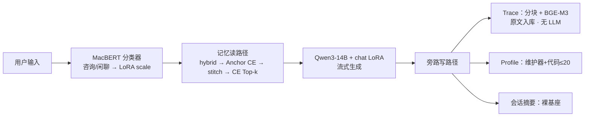

# SoulHarbor 项目大纲与架构
> **叙事主线**：SoulHarbor 面向长期心理支持中的一个统一问题——模型既需要形成更符合倾听需求的回应方式，也需要在多次交流中准确恢复用户的个人经历与最新状态。模型适配与长期记忆分别解决“怎样回应”和“依据什么个人语境回应”，最终在生成阶段协同。

> 保研向一页纸提纲：问题—方法—证据。实现细节见 `03`；工程落地见 `05`。

---

## 1. 项目定位

SoulHarbor 是面向校园心理支持的长期对话研究原型。项目从两组相互关联的问题出发：

1. 通用模型容易产生重复、标准化的回答，用户尚未表达完整就开始分析和给建议，对需要倾听与安慰的场景显得过于理性；
2. 多次交流中缺少稳定的个人连续性，现有记忆又容易以孤立片段或静态结论表示用户，难以处理上下文缺失、状态变化和个性化依据不可靠的问题。

因此系统采用两个连续层次：

| 层次 | 核心问题 | 主要方法 |
|------|----------|----------|
| **回应方式适配** | 如何减少模板化、过早建议和理性说教，使回复更重视倾听、澄清和情绪承接 | Qwen3-14B 上 PT→SFT→DPO；MacBERT 调节同一 LoRA 的推理 scale |
| **长期经历利用** | 如何在跨会话中恢复当前有效、上下文完整的个人经历，避免旧状态和孤立事实干扰 | Trace 原文证据；Planner + Hybrid + 多查询 Anchor CE + Adaptive Stitch + CE Top-k |

二者在生成前结合：长期记忆提供与当前问题相关的个人语境，领域适配模型决定如何使用这些信息进行回应。评测也分别进行：模型侧观察输出分布变化，记忆侧固定 reader、只替换记忆路径，检验事实覆盖、陈旧状态和内容质量。

---

## 2. 研究问题与贡献

**研究问题**

1. 如何让开源中文大模型从通用问答倾向转向更符合心理支持需求的互动方式，减少重复模板、过早建议和缺少倾听感的问题？
2. 如何在长期对话中恢复用户的事件背景、明确偏好和最新状态，同时减少孤立片段、旧状态和过度归纳对生成的影响？
3. 如何让模型适配与长期记忆在生成阶段协同，又通过独立评测和消融保持因果归因清晰？

**贡献（条目）**

- **链式领域对齐**：PT（24443）→ SFT（20000）→ DPO（3000）；QLoRA 4-bit，LoRA r=8 / α=16；线上 chat LoRA 即 DPO 产物。
- **路由感知 scale**：MacBERT-base 二分类（意图 3000/300/300）只调节咨询≈0.7 / 闲聊≈0.3；**不**门控记忆；摘要关 LoRA 走裸基座。
- **ER（Experience Rebuild）**：写侧 Trace 零 LLM 原文分块（仅 user 进入 Dense/BM25/ANN）；读侧 Planner（split≤3 子问题）→ Dense50 ∪ BM25 50 → RRF top-40 → **Anchor CE**（Direct：原始 Top-10；Split：每子问题 Top-3 并集，不足用原始 CE 补到 10）→ Adaptive Stitch（余弦扩窗）→ 重叠连通分量 Merge → **CE Top-k≤10** → token budget 打包 → 按记录时间展示。
- **统一 Profile Maintainer**：每条 user 消息后提议 add/update/delete；代码补来源与容量（≤20 / ≤640 tokens）；每轮完整 `<user_profile>` 注入，不参与检索。
- **同协议对照（`all_50`，终版 CE Top-k）**：ER QA **90.8%** / Stale **6.9%** / F1 **0.602** vs Mem0 **68.7%** / **46.6%** / **0.400**。

---

## 3. 总体架构

主路径：用户 → 分类器（scale）→ 记忆**读**路径 → 生成。  
旁路写路径（post-turn）：Trace 原文入库 / Profile 可确认才写 / 条件触发会话摘要。

两个层次仅在「生成前把 `<memory>` 拼进上下文」处交汇。意图与记忆开关解耦。

---

## 4. 回应行为层技术栈

| 组件 | 选型 / 设定 | 作用 |
|------|-------------|------|
| 基座 | **Qwen3-14B**，推理 4-bit NF4 | 唯一生成模型（约 14.8B） |
| 微调 | QLoRA；LoRA **r=8 / α=16** | 单卡可训可部署 |
| 流水线 | **PT → SFT → DPO** | 分布 → 格式 → 偏好 |
| 路由 | **MacBERT-base** → `is_consult` | 只调 scale 0.7/0.3，不控记忆 |
| Scale | 咨询 **0.7** / 闲聊 **0.3**；摘要关 LoRA | 同 adapter、多强度 |
| 记忆编码 | **BGE-M3** dense 1024（不另训）+ 字级 BM25 | Trace 检索；非记忆本体 |
| 训练框架 | LLaMA-Factory | 配置见 `train/` |

选型「是什么 / 原理 / 为何选」详见 `03` §3.7（含因果 LM、MLM、双塔嵌入公式）。

---

## 5. 历史依据层技术栈

| 阶段 | 技术 | 要点 |
|------|------|------|
| 写 · Trace | 确定性分块 + **BGE-M3** | 原样入库；不抽取、不归纳 |
| 写 · Profile | LLM 维护器旁路 | 提议 add/update/delete；代码强制归属/证据/≤20 active；无则空 |
| 写 · 摘要 | 裸基座滚动摘要 | 与 Trace 解耦；不替代原文库 |
| 召回 | Dense top-50 + 字级 **BM25** top-50 → **RRF**（$k=60$） | fused top-40；**仅 user** 进入索引/召回 |
| 精排 | **BGE-reranker-v2-m3** | **Anchor CE**：Direct 原始 Top-10；Split 每子问题 Top-3∪原始补齐到 10（message_id 去重；Planner≤3） |
| 重建 | **stitch** 自适应扩窗 → 合并 | probe=命中 chunk；$\cos\ge 0.40$；重叠连通分量 Merge；硬保留锚点 |
| 选证 | **CE Top-k** | 按 `rerank_score` 取 ≤10；超限窗 skip-continue 装入 token 预算 |
| 注入 | 用户原文 + 全量 active Profile | 候选 ≤10 窗 / ≤20 Profile / 预算 1600；「记录于」+「当前日期」 |

相对 Mem0 类写时抽取：ER 把「理解」推迟到查询时，召回即证据。公式与逐步推导见 `03` §7。

---

## 6. 数据与评测一览

### 6.1 训练规模

| 数据 | 规模 |
|------|------|
| PT | 24443 |
| SFT | ~20000 倾听 + ~274 自我认知（**同一阶段混合**） |
| DPO | 3000 |
| 意图 train / valid / test | 3000 / 300 / 300 |

### 6.2 对话自动指标

SoulChatCorpus seen/unseen 各 1000；jieba 词级 BLEU/ROUGE。**sft** = 进 DPO 前的 SFT 权重（倾听+自我认知混合）；正式跑次解码 temperature=0.95 / top_p=0.75。

| 模型 | BLEU-1 | BLEU-2 | BLEU-3 | BLEU-4 | ROUGE-1 | ROUGE-2 | ROUGE-L |
|------|--------|--------|--------|--------|---------|---------|---------|
| base | 13.23 | 5.55 | 2.50 | 1.32 | 20.52 | 4.17 | 15.04 |
| sft | 29.56 | 13.06 | 6.90 | 4.17 | 30.65 | 7.89 | 24.64 |
| dpo | 27.91 | 12.59 | 6.46 | 3.75 | 31.49 | 8.06 | 24.44 |

解读：SFT 相对 base 大幅跃升；DPO 相对 SFT 的 BLEU 略降、ROUGE-1/2 略升，符合偏好优化（非 n-gram 复现）预期。指标原理与公式见 `03` §3.8；链式权重与 seen/unseen 定义见 `03` §4.8 / §5.1。

### 6.3 记忆对照（同 reader，只换记忆库；`all_50`）

| 方法 | QA（case-avg） | Staleness | 内容 F1 |
|------|----------------|-----------|---------|
| **ER** | **90.8%** | **6.9%** | **0.602** |
| Mem0 | **68.7%** | **46.6%** | **0.400** |

数据：`evaluate/memory/data/all_50.jsonl`（50 案 / 250 题）。跑次：`qa_er_all50`（micro **92.0%**，230/250）/ `qa_mem0_all50`。定义见 `03` §3.8 / §8。

---

## 7. 文档地图

| 文档 | 用途 |
|------|------|
| [01_讲解稿](./01_讲解稿.md) | 口述叙事：为什么做、怎么做、效果如何 |
| **02（本文）** | 保研大纲：定位、贡献、架构、栈与指标总表 |
| [03_详尽技术](./03_详尽技术.md) | 训练、ER 算法、评测协议与超参 |
| [04_面试](./04_面试.md) | 原理推导与答辩问答 |
| [05_工程](./05_工程.md) | 部署、配置、前后端与运维（工程细节只指向此处） |

---

## 8. 关键设计取舍

- **微调与记忆不互相替代**：微调改变模型的回应习惯，记忆提供个人经历；同一历史证据交给不同生成模型，仍可能得到说教式或倾听式的不同回复。
- **意图分类器只调节 LoRA 强度**：它不决定是否检索记忆，避免普通闲聊中的历史引用被错误关闭。
- **Trace 保留原始证据，Profile 只保存少量稳定信息**：事件过程、情绪和状态变化留在 Trace 中，明确身份和沟通偏好进入受限 Profile。
- **Cross-Encoder 放在扩窗前**：CE 负责从较大的候选池中选择 anchor，并直接决定最终 Top-k；时间只用于展示「记录于」日期。
- **原始问题与 Planner 查询共同参与 CE**：Planner 提供分解后的检索目标（最多 3 条），原始问题保留完整实体、时间和事件约束；Split 用每子问题 Top-3 ∪ 原始补齐保证多目标覆盖。
- **结果按阶段解读**：对话自动指标用于观察领域适配前后的输出分布，记忆 QA / staleness / F1 用于分析长期证据路径，二者不混为一个总分。
