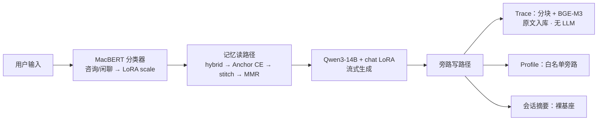

# SoulHarbor 项目大纲与架构

> 保研向一页纸提纲：问题—方法—证据。实现细节见 `03`；工程落地见 `05`。

---

## 1. 项目定位

SoulHarbor 是面向校园场景的心理健康**辅助对话**研究原型（非临床诊断系统）。目标拆成两条可独立陈述、又在生成前汇合的主线：

| 线 | 问题 | 做法（一句话） |
|----|------|----------------|
| **对话线** | 通用 LLM 在心理场景欠共情、易敷衍/说教 | Qwen3-14B 上 PT→SFT→DPO；MacBERT 只调同一份 LoRA 的推理 scale |
| **记忆线** | 跨会话需要记忆，写时抽取易误记且自我强化 | Trace **原文**入库；查询时 ER 扩窗重建；Profile 仅白名单旁路 |

证据口径分开：对话线看相对裸基座的 BLEU/ROUGE；记忆线在**固定 reader、只换记忆库**协议下看 QA / Staleness / 内容 F1（ER vs Mem0）。形态为单卡可复现原型；Web/API 不在本稿展开（→ `05`）。

---

## 2. 研究问题与贡献

**研究问题**

1. 如何在单卡约束下，把心理对话从「能答」对齐到「更适合倾听」（领域分布 + 指令格式 + 偏好）？
2. 如何让跨会话记忆保留共现与最新状态，又避免写时压缩造成的误记与 stale？
3. 如何用可复现协议证明记忆收益来自「记忆形态」，而非答题模型差异？

**贡献（条目）**

- **链式领域对齐**：PT（24443）→ SFT（20000）→ DPO（3000）；QLoRA 4-bit，LoRA r=8 / α=16；线上 chat LoRA 即 DPO 产物。
- **路由感知 scale**：MacBERT-base 二分类（意图 3000/300/300）只调节咨询≈0.7 / 闲聊≈0.3；**不**门控记忆；摘要关 LoRA 走裸基座。
- **ER（Experience Rebuild）**：写侧 Trace 零 LLM 原文分块；读侧 Planner → Dense50 ∪ BM25 50 → RRF top-40 → **多查询 coverage Anchor CE**（top-12 种子）→ Adaptive Stitch → Merge → Legacy 时间感知 MMR → 时间序注入（窗级 CE 关闭）。
- **窄白名单 Profile**：旁路抽取 `identity` / `education` / `location` / `preference`；诊断、人格标签、瞬时情绪、单次事件不收。
- **同协议对照（`all_50`，终版 coverage CE）**：ER QA **90.5%** / Stale **8.6%** / F1 **0.783** vs Mem0 **68.7%** / **46.6%** / **0.400**。

---

## 3. 总体架构

主路径：用户 → 分类器（scale）→ 记忆**读**路径 → 生成。  
旁路写路径（post-turn）：Trace 原文入库 / Profile 白名单 / 条件触发会话摘要。

两条线仅在「生成前把 `<memory>` 拼进上下文」处交汇。意图与记忆开关解耦。

---

## 4. 对话线技术栈

| 组件 | 选型 / 设定 | 作用 |
|------|-------------|------|
| 基座 | **Qwen3-14B**，推理 4-bit NF4 | 唯一生成模型（约 14.8B） |
| 微调 | QLoRA；LoRA **r=8 / α=16** | 单卡可训可部署 |
| 流水线 | **PT → SFT → DPO** | 分布 → 格式 → 偏好 |
| 路由 | **MacBERT-base** → `is_consult` | 只调 scale 0.7/0.3，不控记忆 |
| Scale | 咨询 **0.7** / 闲聊 **0.3**；摘要关 LoRA | 同 adapter、多强度 |
| 记忆编码 | **BGE-M3** dense 1024（不另训）+ 字级 BM25 | Trace 检索；非记忆本体 |
| 训练框架 | LLaMA-Factory | 配置见 `train/` |

选型「是什么 / 原理 / 为何选」详见 `03` §3.7（含因果 LM、MLM、双塔嵌入公式）。

---

## 5. 记忆线技术栈

| 阶段 | 技术 | 要点 |
|------|------|------|
| 写 · Trace | 确定性分块 + **BGE-M3** | 原样入库；不抽取、不归纳 |
| 写 · Profile | LLM 白名单旁路 | `identity` / `education` / `location` / `preference`；无则空 |
| 写 · 摘要 | 裸基座滚动摘要 | 与 Trace 解耦；不替代原文库 |
| 召回 | Dense top-50 + 字级 **BM25** top-50 → **RRF**（$k=60$） | fused top-40；助理块 ×0.55 |
| 精排 | **BGE-reranker-v2-m3** | **裸 Anchor CE**（原始 query ∪ Planner 子查询；coverage 选 top-12 种子） |
| 重建 | **stitch** 自适应扩窗 → 合并 | $\cos\ge 0.40$ 或（邻接 ≤2 ∧ 实体交） |
| 选证 | **Legacy 时间感知 MMR** | $R_{\mathrm{content}}=2\cdot s_{\mathrm{fused}}+1.5\cdot\mathrm{Jaccard}$；recency $\beta=0.8$、week $0.5$；$\lambda=0.7$ |
| 注入 | 用户原文 + 全量 active Profile | ≤6 窗 / ≤30 Profile / 预算 1600 |

相对 Mem0 类写时抽取：ER 把「理解」推迟到查询时，召回即证据。公式与逐步推导见 `03` §7。

---

## 6. 数据与评测一览

### 6.1 训练规模

| 数据 | 规模 |
|------|------|
| PT | 24443 |
| SFT | ~20000 倾听 + ~274 自我认知（**同一阶段混合**） |
| DPO | 3000 |
| 意图 train / valid / test | 3000 / 300 / 300 |

### 6.2 对话自动指标

SoulChatCorpus seen/unseen 各 1000；jieba 词级 BLEU/ROUGE。**sft** = 进 DPO 前的 SFT 权重（倾听+自我认知混合）；正式跑次解码 temperature=0.95 / top_p=0.75。

| 模型 | BLEU-1 | BLEU-2 | BLEU-3 | BLEU-4 | ROUGE-1 | ROUGE-2 | ROUGE-L |
|------|--------|--------|--------|--------|---------|---------|---------|
| base | 13.23 | 5.55 | 2.50 | 1.32 | 20.52 | 4.17 | 15.04 |
| sft | 29.56 | 13.06 | 6.90 | 4.17 | 30.65 | 7.89 | 24.64 |
| dpo | 27.91 | 12.59 | 6.46 | 3.75 | 31.49 | 8.06 | 24.44 |

解读：SFT 相对 base 大幅跃升；DPO 相对 SFT 的 BLEU 略降、ROUGE-1/2 略升，符合偏好优化（非 n-gram 复现）预期。指标原理与公式见 `03` §3.8；链式权重与 seen/unseen 定义见 `03` §4.8 / §5.1。

### 6.3 记忆对照（同 reader，只换记忆库；`all_50`）

| 方法 | QA（case-avg） | Staleness | 内容 F1 |
|------|----------------|-----------|---------|
| **ER** | **90.5%** | **8.6%** | **0.783** |
| Mem0 | **68.7%** | **46.6%** | **0.400** |

数据：`evaluate/memory/data/all_50.jsonl`（50 案 / 250 题）。跑次：`qa_er_all50` / `qa_mem0_all50`。定义见 `03` §3.8 / §8。

---

## 7. 文档地图

| 文档 | 用途 |
|------|------|
| [01_讲解稿](./01_讲解稿.md) | 口述叙事：为什么做、怎么做、效果如何 |
| **02（本文）** | 保研大纲：定位、贡献、架构、栈与指标总表 |
| [03_详尽技术](./03_详尽技术.md) | 训练、ER 算法、评测协议与超参 |
| [04_面试](./04_面试.md) | 原理推导与答辩问答 |
| [05_工程](./05_工程.md) | 部署、配置、前后端与运维（工程细节只指向此处） |

---

## 8. 明确不做的事

- **不做临床诊断 / 治疗建议权威**：定位为校园心理**辅助**对话，非医疗器械或诊疗决策。
- **不做关键词拦截门控**：意图与「记住/忘掉」不靠正则关键词；边界靠分类器职责收窄与 Profile **schema 白名单**。
- **不以写时抽取为主路径**：Trace 不把对话压成事实句再入库；写时 LLM 理解仅限 Profile 旁路，且字段严格受限。
- **不把分类器绑死记忆开关**：闲聊也可能引用历史；误判只影响语气强度。
- **不以 BLEU 单指标判 DPO 成败**：心理对话无唯一参考答案；DPO 目标是偏好，需结合 ROUGE 与任务叙事解读。
- **本稿不写 Vue / API 细节**：产品形态与接口见 `05`。
