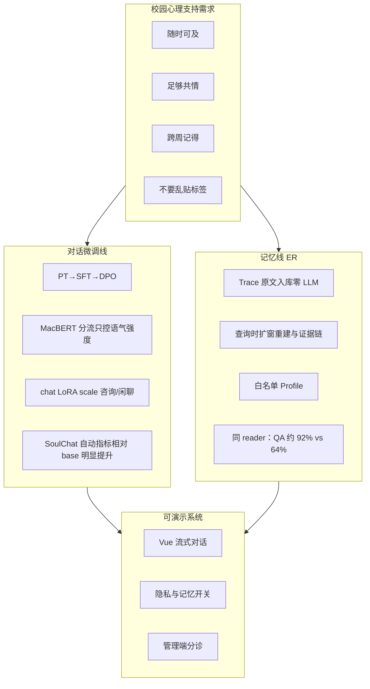

# SoulHarbor：面向校园心理支持的领域微调与长期记忆

> 与当前 `product_app/` 源码、`train/`、`evaluate/` 对齐。本文回答三个问题：为什么做、怎么做、做得怎样。实现细节见 `01`～`06`；文中数字均可在 `evaluate/*/runs/` 中核对。

---

## 0. 摘要

高校心理咨询资源紧张，许多学生更愿意先找一个「能说话的地方」。通用大模型虽便于对话，却在心理健康场景中暴露两类结构性不足：一是语气未针对倾听任务对齐，容易空泛、说教或敷衍；二是缺乏可靠的跨会话记忆——即便系统尝试「记住用户」，主流做法往往在写入时把对话压缩成事实条目，在心理场景中极易把瞬时情绪固化为错误标签。

SoulHarbor 用两条解耦的技术线回应上述问题。对话线在 Qwen3-14B 上完成继续预训练、指令微调与 DPO 偏好对齐，并用独立分类器按咨询/闲聊调节同一份 LoRA 的推理强度，使模型学会「怎么说」。记忆线采用原文入库与查询时经历重建（ER）：写入阶段不做事实抽取，检索阶段再把原文扩窗重建为可用的经历证据，使系统「记得住」且「不乱记」。同协议对照实验表明，在固定答题模型、只更换记忆库的条件下，长程记忆 QA 准确率由约 64% 提升至约 92%。

---

## 1. 背景与动机

近年来，大语言模型在通用对话上表现突出，也被陆续引入心理咨询与情绪支持场景。SoulChat 等工作指出：用户寻求心理支持时，真正需要的往往是共情、倾听与安慰，而不是立刻给出的通用建议；若不加领域适配，模型容易急于给方案、语气生硬或空泛。EmoLLM 等开源实践进一步表明，在中文心理语料上继续预训练与指令微调，可以明显改善基座模型对心理对话分布的适应。这些工作共同说明：心理健康对话不是「换一个 system prompt」就能做好的任务，需要专门的数据与对齐。

与此同时，长程个性化对话还依赖跨会话记忆。通用助手通常只有会话内上下文；一旦跨天、跨周，上周的学业压力、室友矛盾或失眠经历便无从衔接。现有智能体记忆方案大致可分两类。一类以写时抽取为代表：每轮用大模型把对话压成事实句再入库检索，工程上简洁，但抽取本身会损失共现细节，也可能把「这次面试没发挥好」改写成稳定的负面标签。另一类强调保留经历原文，在检索命中后再扩展邻域上下文，更利于事实完整性与可审计性。对心理支持而言，代价结构尤为特殊：漏掉一段旧经历最多是「没帮上忙」，而错误归纳却可能把用户推向错误的自我认知。因此，记忆系统不能只追求「记得更多」，更要避免「乱记」。

校园场景把上述需求具体化了。咨询资源有限、预约等待长，污名化也让部分学生更倾向先使用低门槛的对话入口。SoulHarbor 的目标是提供一个随时可及、语气足够共情、又能跨周衔接经历的辅助倾听系统，且记忆可开关、可遗忘。

---

## 2. 问题定义

综合背景，SoulHarbor 要同时缓解两类痛点。

第一类是**对话能力不适配**。基座模型的默认语气更接近百科问答：空泛安慰、说教、复读或冷冰冰的建议都很常见。咨询倾诉与日常寒暄所需的说话方式也不同——前者需要更稳定的共情与分寸，后者需要更轻、避免「假装在做治疗」。若让同一个大模型每轮自我判断并切换人格，成本高且不稳定。

第二类是**长期记忆的形态风险**。没有记忆，模型再共情，跨周回来仍是陌生人。有了记忆若采用写时抽取，则「记错」会在后续每一轮被反复注入并自我强化。心理对话里，一次冷战、一句气话、一次失利，都不应当被系统写成人格标签。

由此得到设计立场：对话线负责「怎么说」，记忆线负责「怎么记」；两条线在工程上解耦，只在生成前把记忆块拼进 system 时交汇。记忆侧进一步收敛为一句话——Trace 写入尽量不「理解」用户；少量稳定偏好仅经用户确认后落库；读路径再把原文编年重建成可用的经历证据。

---

## 3. 对话线：领域微调与路由感知生成

### 3.1 训练路线

基座选用 Qwen3-14B：中文与指令遵循能力较强，在 4-bit 量化加 LoRA 下可单卡部署。训练基于 LLaMA-Factory 的 QLoRA（4-bit NF4），全链路统一 rank=8、α=16，按 PT → SFT → DPO 链式续训并各自保留独立 LoRA 目录。

继续预训练使用 EmoLLM 整理的心理问答片段约 2.4 万条，以因果语言建模让基座在心理中文分布上更熟悉。指令微调以 SoulChatCorpus 为主体（约九成），混入约一成 EmoLLM 多轮数据，共约 2 万条 ShareGPT 多轮样本，学习咨询节奏下的应答方式。随后以 3000 对偏好数据做 DPO：chosen 取自语料中较好的共情回复，rejected 由外部模型按「空泛、欠共情、敷衍、说教」指令合成，专门压制心理场景中最刺眼的失败模式。线上 chat LoRA 即该 DPO 产物。

数据构建细节与样例见 `04`。

### 3.2 路由与语气强度

心理对话中，咨询与闲聊是两种说话方式。SoulHarbor 不让 14B 每轮自我裁定，而用独立的 MacBERT-base 二分类器判断本轮是否为咨询意图。分类器在 3000 条咨询/闲聊对照数据上训练（正负 1:1，按字长对齐），验证准确率约 99.7%。其唯一职责是调节同一份 chat LoRA 的推理 scale：咨询约 0.7，闲聊约 0.3。会话滚动摘要关闭 LoRA，走裸基座，避免共情腔渗进压缩文本。

分类器不控制记忆开关。是否检索长期记忆仅由用户设置决定：闲聊中也可能提到上周的事，把记忆绑死在咨询路由上反而丢信息；把分类器职权缩小到「语气旋钮」后，偶发误判的代价也只是语气强弱，而不是整条对话行为被带偏。

### 3.3 对话评测

在 SoulChatCorpus 的 seen/unseen 各 1000 条上，对生成回复与参考答案计算词级 BLEU/ROUGE（jieba 分词）。结果如下。

| 模型 | BLEU-1 | ROUGE-1 | ROUGE-L |
|------|--------|---------|---------|
| base（裸 Qwen3-14B） | 13.23 | 20.52 | 15.04 |
| sft | 29.56 | 30.65 | 24.64 |
| dpo（线上 chat LoRA） | 27.91 | 31.49 | 24.44 |

完整 BLEU-1～4 与 ROUGE-1/2/L 见 `02` §10.6，跑次位于 `evaluate/dialogue/runs/soulchat_corpus_eval_20260426_092741/`。

SFT 相对 base 的跃升（BLEU-1 约 +16、ROUGE-L 约 +9.6）说明领域对齐有效。DPO 的 BLEU 略低于 SFT，而 ROUGE-1/2 略高或持平——这符合预期：DPO 优化的是「更共情、少敷衍」的偏好，表达更自然多样时，与单一参考答案的字面重合可能下降。心理对话没有唯一标准答案，自动指标只适合做相对比较。

---

## 4. 记忆线：经历重建（ER）

### 4.1 核心命题

长期记忆子系统称为 ER（Experience Rebuild），实现位于 `product_app/app/memory/`。其命题是：不要在写入时把人生压缩成几条确信事实；而要在提问时，从原文里重建那段经历的证据。

### 4.2 写路径与读路径

每条用户与助理消息在对话落库后进入后台写入：按确定性规则分块，用 BGE-M3 向量化，原样写入 SQLite。Trace 入库没有大模型参与——不抽取经历事实、不合并覆盖、不生成摘要、不把瞬时情绪升级成特质。旁路 Profile 用 LLM 抽取白名单内的长期画像（姓名、教育、稳定偏好等），无则不写；记住/忘掉由 LLM 解析，无关键词门控。

当用户开启长期记忆时，每轮生成前执行检索管线。查询可经可选规划器拆成少量子查询；随后以向量相似度与字级 BM25 混合召回锚点，再沿会话做自适应扩窗（语义相似度为主、相邻实体承接为补），合并重叠窗后，用衰减感知的 MMR（并加入相对新近性与周桶多样性）选择少数经历窗，按时间升序注入。注入时只取用户原文，并附上全部已确认偏好；被注入的窗会做一次使用强化。块以 system 角色进入上下文，并明确说明其为历史背景、冲突以当前说法为准、禁止补充检索结果之外的事实。

除可选的查询规划外，检索主体由代码编排。写侧 Trace 仍为零 LLM。代价是检索逻辑更复杂，换来的是召回即证据、注入即原文，记忆库本身从不替用户下结论。

### 4.3 与相关工作的关系

评测对照的基线是 Mem0 一类写时抽取事实句再向量检索的路线。ER 与之的分歧不在「要不要记忆」，而在「记忆是什么形态」：前者在写入时完成压缩与判断，后者把判断推迟到查询时，并用扩窗与选窗尽量保住共现与最新状态。也有工作强调保存经历原文、命中后再扩展邻域；ER 沿这一方向推进，扩窗收成可解释的一主一补规则，选择器用标准 MMR 并显式加入相对新近性以抑制 stale。系统刻意保持单机 SQLite，经历关联在查询时动态建立。

### 4.4 记忆评测

对比实验最容易犯的错误是「换方法也换答题模型」。本项目的协议刻意隔离该变量：用外部模型按规范合成 30 条长程咨询弧，每条配 3 道测试题与应记/应忘事实集；ER 与 Mem0 在同一对话流上逐轮写入，再在延迟测试点用同一个固定 reader 只接收「该方法的记忆检索块 + 试题」作答。主结果如下。

| 方法 | QA 准确率 | Staleness 率 | 内容 F1 |
|------|-----------|--------------|---------|
| ER（终版） | ≈92% | ≈14% | ≈0.86 |
| Mem0（同协议） | ≈64% | ≈43% | ≈0.48 |

逐类看，context / detail / preference 接近满分；跨会话整合约 0.93；current_state 约 0.87；temporal 约 0.73（双方共同短板）。选择器消融表明：去掉相对新近性后 QA 曾降至约 84%、staleness 升至约 43%；补回后回升。协议与跑次见 `05`、`06`；正式结果在 `evaluate/memory/runs/qa_er_20260802_210915/`。

---

## 5. 设计演进

ER 并非一次定稿，而是被实验证据逐步逼出来的。早期曾尝试写时抽取：每轮让模型把对话压成事实条目再增删改查。即便工具调用指标尚可，结构性隐患仍在——只要写入时「理解」，就一定会偶尔写错，而写错的标签会长期留在库里。随后尝试过分层记忆与写时调和，试图用衰减、合并缓解污染，但根因未变：底层仍在写入时改写用户。

转向存原文并优化读路径之后，方向才清晰起来。终稿进一步删掉写时 trace 调和，使 Trace 写路径成为零 LLM 的原文入库；Profile 旁路收敛为窄白名单长期画像抽取；读路径补上自适应扩窗、衰减感知 MMR（含相对新近性）与时间排序注入。中间态快照保留在 `archive/`，线上仅描述 ER 终态。

因此，记忆侧真正改进的不是「检索更花哨」，而是把「理解」从写入时刻挪到查询时刻，并从结构上降低写时污染的可能。对抗过时状态也主要依赖读路径的相关选择、去冗余与 token 预算，而不是写时生命周期状态机。

---

## 6. 系统合成

两条线合在一起，才构成可演示的校园心理支持助手：用户端提供流式对话与隐私/记忆开关，管理端提供匿名化会话浏览与分诊队列。整体关系可概括如下。

微调解决语气与分寸，记忆解决连续与证据；两件事工程上解耦，合起来才成为完整系统。记忆的关键不在「记得更多」，而在拒绝在写入时乱记。同 reader、只换记忆库的协议，用来证明差距来自记忆形态。

---

## 7. 文档地图

| 文档 | 内容 |
|------|------|
| 本文 `00` | 背景、动机、方案故事与效果总览 |
| `01_项目大纲与架构.md` | 目录、架构、模块职责与模型选型 |
| `02_项目详尽技术文档.md` | 配置、链路、引擎、训练超参与评测 |
| `03_保研面试问答手册.md` | 技术问答与原理 |
| `04_数据构建与样例.md` | 训练数据来源与样例 |
| `05` / `06` | ER 算法与记忆对比实验 |
| `evaluate/` | 对话与记忆的真实跑次 |

---

## 8. 小结

SoulHarbor 把两件难事收进同一个系统：把大模型调教成更愿意好好听的校园助手，并把长期记忆建成经历证据库，而不是人格标签机。对话线上，领域微调相对裸基座带来清晰的自动指标提升；记忆线上，同协议对照表明原文库加查询时重建相对写时抽取路线具有可核对的优势。训练流水线、评测跑次与产品源码相互印证，构成这一故事能够立住的依据。
